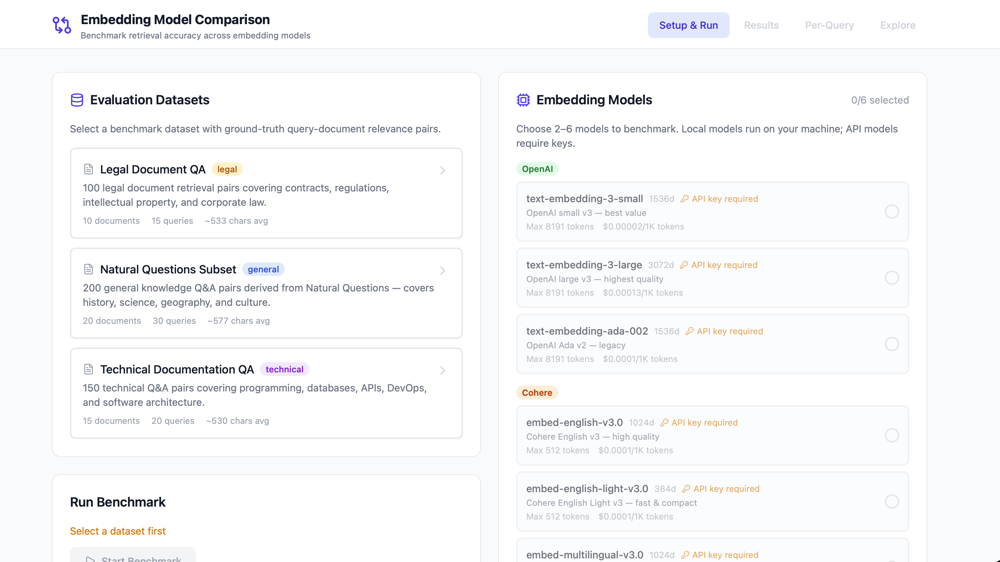
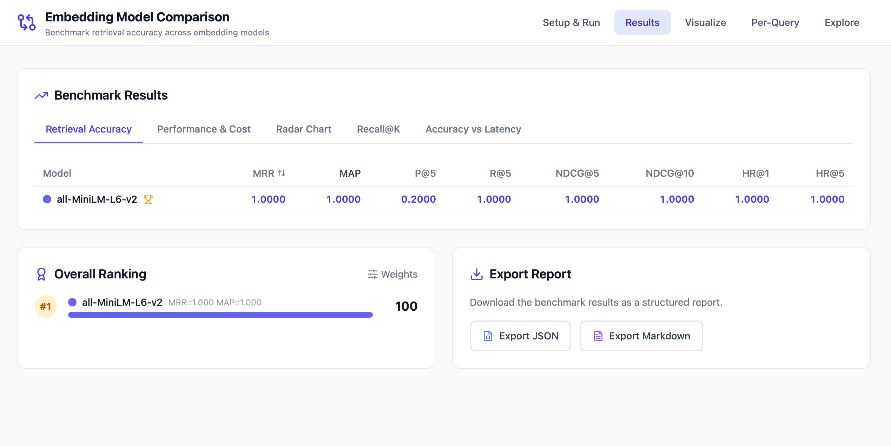
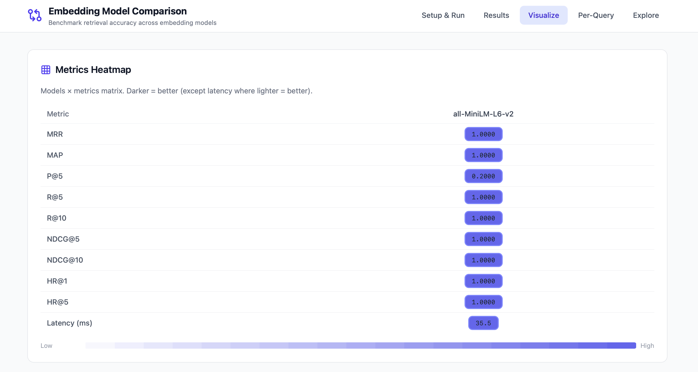
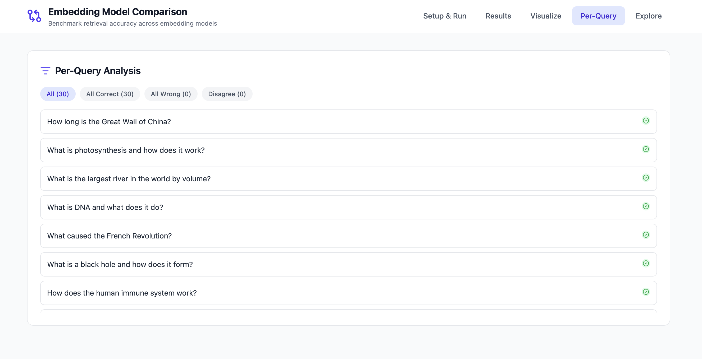

# 🔬 Embedding Model Comparison

> Benchmark embedding models (OpenAI, Cohere, and open-source) on the same dataset. Compare retrieval accuracy, latency, cost, and embedding quality — all from one interactive dashboard.

---

## ✨ Features

- 🤖 **11 Embedding Models** — OpenAI (3), Cohere (3), open-source: MiniLM, E5, BGE (5)
- 📚 **3 Built-in Datasets** — Natural Questions, TechQA, Legal QA with ground-truth relevance
- 📊 **Full IR Metrics** — Precision@K, Recall@K, MRR, NDCG@K, MAP, Hit Rate@K
- ⚡ **Performance Tracking** — Latency percentiles, throughput, memory usage, API cost
- 🧬 **Embedding Quality** — Isotropy analysis, UMAP visualization
- 📈 **Interactive Dashboard** — Radar charts, heatmaps, scatter plots, sortable tables
- 🔍 **Per-Query Analysis** — Drill into where models agree/disagree
- 🧪 **Live Query Explorer** — Test ad-hoc queries against cached embeddings
- 🏆 **Weighted Ranking** — Customizable overall model ranking with adjustable weights
- 📤 **Export Reports** — Download results as JSON or Markdown

---

## 📸 Screenshots

### Setup & Run
Select a dataset and pick embedding models to benchmark. Local models run instantly — API models show cost estimates before running.



### Benchmark Results
Full retrieval accuracy table with sortable IR metrics, overall weighted ranking, and one-click report export.



### Visualize — Metrics Heatmap
Models × metrics color-coded matrix. Darker = better (except latency where lighter = better).



### Per-Query Analysis
Filter queries by "all correct", "all wrong", or "models disagree" to find where models struggle.



---

## 🛠️ Tech Stack

| Layer | Technologies |
|-------|-------------|
| **Backend** | Python, FastAPI, sentence-transformers, FAISS, NumPy, scikit-learn |
| **Frontend** | React, Vite, Tailwind CSS, Recharts, Lucide Icons |
| **Search** | FAISS (cosine, dot-product, euclidean) |
| **Models** | OpenAI API, Cohere API, HuggingFace sentence-transformers |

---

## 📁 Project Structure

```
embedding-model-comparison/
├── backend/
│   ├── app/
│   │   ├── api/routes/          # FastAPI route handlers
│   │   ├── embeddings/          # Provider wrappers (OpenAI, Cohere, local)
│   │   ├── benchmark/           # Runner, FAISS retrieval, cache
│   │   ├── evaluation/          # IR metrics, performance, embedding quality
│   │   ├── datasets/builtin/    # 3 built-in benchmark datasets
│   │   ├── models/schemas.py    # Pydantic models
│   │   ├── config.py            # Model registry & settings
│   │   └── main.py              # FastAPI entry point
│   └── requirements.txt
├── frontend/
│   ├── src/
│   │   ├── api/client.js        # Axios API client
│   │   ├── components/          # 10 React components
│   │   ├── App.jsx              # Main app layout with tab navigation
│   │   └── main.jsx             # Entry point
│   └── package.json
├── assets/                      # Screenshots
└── README.md
```

---

## 🚀 Getting Started

### Prerequisites

- 🐍 Python 3.10+
- 📦 Node.js 18+

### Backend Setup

```bash
cd backend
python3 -m venv venv
source venv/bin/activate
pip install -r requirements.txt

# Start the server
uvicorn app.main:app --reload --port 8000
```

### Frontend Setup

```bash
cd frontend
npm install
npm run dev
```

Open 👉 [http://localhost:5173](http://localhost:5173) in your browser.

### 🔑 API Keys (Optional)

For OpenAI and Cohere models, set environment variables:

```bash
export OPENAI_API_KEY="sk-..."
export COHERE_API_KEY="..."
```

> 💡 Local models (MiniLM, E5, BGE) work without any API keys — perfect for getting started.

---

## 🤖 Supported Models

| Model | Provider | Dimension | Cost |
|-------|----------|-----------|------|
| text-embedding-3-small | 🟢 OpenAI | 1536 | $0.02/1M tokens |
| text-embedding-3-large | 🟢 OpenAI | 3072 | $0.13/1M tokens |
| text-embedding-ada-002 | 🟢 OpenAI | 1536 | $0.10/1M tokens |
| embed-english-v3.0 | 🟠 Cohere | 1024 | $0.10/1M tokens |
| embed-english-light-v3.0 | 🟠 Cohere | 384 | $0.10/1M tokens |
| embed-multilingual-v3.0 | 🟠 Cohere | 1024 | $0.10/1M tokens |
| all-MiniLM-L6-v2 | 🔵 Local | 384 | Free |
| e5-small-v2 | 🔵 Local | 384 | Free |
| e5-base-v2 | 🔵 Local | 768 | Free |
| bge-small-en-v1.5 | 🔵 Local | 384 | Free |
| bge-base-en-v1.5 | 🔵 Local | 768 | Free |

---

## 🌐 API Endpoints

| Method | Endpoint | Description |
|--------|----------|-------------|
| `GET` | `/api/models` | 📋 List available embedding models |
| `POST` | `/api/models/validate` | ✅ Check model accessibility |
| `GET` | `/api/datasets` | 📚 List benchmark datasets |
| `GET` | `/api/datasets/:id` | 📄 Get dataset with documents & queries |
| `POST` | `/api/datasets/build` | 🏗️ Create custom dataset |
| `POST` | `/api/benchmark/run` | ▶️ Start a benchmark run |
| `GET` | `/api/benchmark/status/:id` | 📊 Get benchmark progress |
| `POST` | `/api/benchmark/cancel/:id` | ⏹️ Cancel a running benchmark |
| `GET` | `/api/results/:run_id` | 📈 Get full benchmark results |
| `GET` | `/api/results/:run_id/embeddings` | 🧬 Get embedding quality analysis |
| `GET` | `/api/results/:run_id/umap` | 🗺️ Get UMAP coordinates |
| `POST` | `/api/results/:run_id/export` | 📤 Export report (JSON/Markdown) |
| `POST` | `/api/explore/query` | 🔍 Live query against cached embeddings |
| `POST` | `/api/explore/similarity` | 🔗 Compare text similarity across models |
| `GET` | `/api/health` | 💚 Health check |

---

## 📖 Usage

1. **📚 Select a dataset** — Choose from 3 built-in benchmark datasets with ground-truth relevance
2. **🤖 Pick models** — Select 1–6 embedding models to compare (local models need no API keys)
3. **▶️ Run benchmark** — Click "Start Benchmark" and watch real-time progress with ETA
4. **📊 Analyze results** — Switch between Accuracy, Performance, Radar, Recall@K, and Scatter tabs
5. **🏆 Compare rankings** — View weighted overall ranking with customizable metric weights
6. **🔥 Visualize** — Explore the metrics heatmap, UMAP embedding space, and similarity inspector
7. **🔍 Drill into queries** — Filter by "all correct", "all wrong", or "models disagree"
8. **🧪 Explore live** — Type custom queries to see how each model retrieves documents
9. **📤 Export** — Download your benchmark report as JSON or Markdown

---

## 📄 License

MIT
